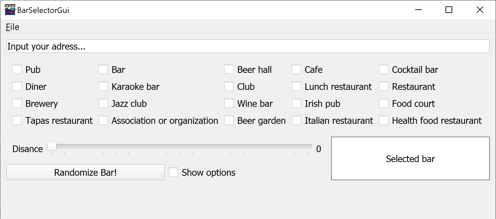

# BarSelector





## Install
Create virtual environment 
```
python -m venv venv
.\venv\Scripts\Activate.ps1
pip install -r requirements.txt
```

To create a database of bars, you need a [SerpApi](https://serpapi.com/) API key. 

